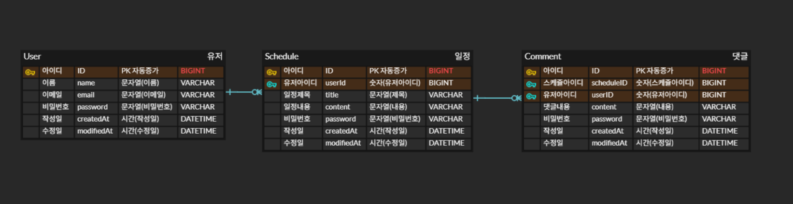

## 📅 일정관리 앱
Spring Boot를 기반으로 한 일정 관리 REST API 서버입니다

사용자는 회원가입 후 로그인하여 일정(Schedule)을 생성하고, 

해당 일정에 댓글(Comment)을 작성할 수 있습니다.
## ⚙️ 기능
### 👤 User (회원)
- 회원 생성
- 단건 조회
- 전체 조회
- 수정
- 삭제
### 📅 Schedule (일정)
- 일정 생성 (로그인 사용자 기준)
- 단건 조회 (본인 일정만)
- 전체 조회 (본인 일정 목록)
- 수정 (본인 일정만)
- 삭제 (댓글 포함 삭제)
### 💬 Comment (댓글)
- 댓글 생성 (특정 일정에 작성)
- 특정 일정의 댓글 목록 조회
- 댓글 수정 (본인 댓글만)
- 댓글 삭제 (본인 댓글만)
### 🔐 인증 / 인가
- 비밀번호 암호화 (PasswordEncoder)
- 세션 기반 인증 (HttpSession)
- 로그인 시 SessionUser 저장

## 🛠 기술 스택
- Java 17
- Spring Boot
- MySQL
- Spring Data JPA
- Gradle
- Postman

## 📊 ERD

## 📌 API 명세서

<details>
<summary><strong>📅 일정 API</strong></summary>

| 기능       | Method | URL                     | 상태코드               |
| -------- | ------ | ----------------------- | ------------------ |
| 일정 생성    | POST   | /schedules              | 201, 400           |
| 일정 전체 조회 | GET    | /schedules              | 200                |
| 일정 단건 조회 | GET    | /schedules/{scheduleId} | 200, 404           |
| 일정 수정    | PATCH  | /schedules/{scheduleId} | 200, 400, 401, 404 |
| 일정 삭제    | DELETE | /schedules/{scheduleId} | 204, 401, 404      |

<details> <summary><strong>일정 생성</strong></summary>

### Request

- POST /schedules

```
ex)
{
"title": "title",
"content": "content",
"userId": 1
}
```

### Response

- 201 Created
```
ex)
{
"id": 1,
"title": "title",
"content": "content",
"userId": 1,
"createdAt": "2026-04-16T00:00:00",
"updatedAt": "2026-04-16T00:00:00"
}
```

### Error
- 400 Bad Request (필수값 누락)
</details>

<details> <summary><strong>일정 전체 조회</strong></summary>

### Request

- GET /schedules

### Response

- 200 OK
```
ex)
[
{
"id": 1,
"title": "title",
"content": "content",
"userId": 1,
"createdAt": "2026-04-16T00:00:00",
"updatedAt": "2026-04-16T00:00:00"
},
{
"id": 2,
"title": "title2",
"content": "content2",
"userId": 1,
"createdAt": "2026-04-16T00:00:00",
"updatedAt": "2026-04-16T00:00:00"
}
]
```
</details>
<details> <summary><strong>일정 단건 조회</strong></summary>

### Request

- GET /schedules/{scheduleId}

### Response

- 200 OK

```
ex)
{
"id": 1,
"title": "title",
"content": "content",
"userId": 1,
"createdAt": "2026-04-16T00:00:00",
"updatedAt": "2026-04-16T00:00:00"
}
```

### Error
- 404 Not Found (일정 없음)
</details>
<details> <summary><strong>일정 수정</strong></summary>

### Request

- PATCH /schedules/{scheduleId}

```
ex)
{
"title": "title",
"content": "content"
}
```

### Response

- 200 OK

```
ex)
{
"id": 1,
"title": "title",
"content": "content",
"updatedAt": "2026-04-16T00:00:00"
}
```

### Error
- 400 Bad Request (요청값 오류)
- 401 Unauthorized (로그인 필요)
- 404 Not Found (일정 없음)
</details>
<details> <summary><strong>일정 삭제</strong></summary>

### Request

- DELETE /schedules/{scheduleId}

### Response

- 04 No Content

### Error
- 401 Unauthorized (로그인 필요)
- 404 Not Found (일정 없음)
</details>
</details>

<details>
<summary><strong>👤 유저 API</strong></summary>

| 기능       | Method | URL             | 상태코드               |
| -------- | ------ | --------------- | ------------------ |
| 유저 생성    | POST   | /users          | 201, 400           |
| 유저 전체 조회 | GET    | /users          | 200                |
| 유저 단건 조회 | GET    | /users/{userId} | 200, 404           |
| 유저 수정    | PUT    | /users/{userId} | 200, 400, 401, 404 |
| 유저 삭제    | DELETE | /users/{userId} | 204, 401, 404      |

<details> <summary><strong>유저 생성</strong></summary>

### Request

- POST /users
```
ex)
{
"name": "name",
"email": "email@email.com",
"password": "password"
}
```
### Validation
- password: 8자 이상 필수
- email: 이메일 형식 필요

### Response

- 201 Created

```
ex)
{
"id": 1,
"name": "name",
"email": "email@email.com",
"createdAt": "2026-04-16T00:00:00",
"updatedAt": "2026-04-16T00:00:00"
}
```
### Error
- 400 Bad Request (필수값 누락)
</details>
<details> <summary><strong>유저 전체 조회</strong></summary>

### Request

- GET /users

### Response

- 200 OK

```
ex)
[
{
"id": 1,
"name": "name",
"email": "email@email.com",
"createdAt": "2026-04-16T00:00:00",
"updatedAt": "2026-04-16T00:00:00"
},
{
"id": 2,
"name": "name2",
"email": "email@email.com2",
"createdAt": "2026-04-16T00:00:00",
"updatedAt": "2026-04-16T00:00:00"
}
]
```
</details>
<details> <summary><strong>유저 단건 조회</strong></summary>

### Request

- GET /users/{userId}

### Response

- 200 OK
```
ex)
{
"id": 1,
"name": "name",
"email": "email@email.com",
"createdAt": "2026-04-16T00:00:00",
"updatedAt": "2026-04-16T00:00:00"
}
```
### Error
- 404 Not Found (유저 없음)
</details>
<details> <summary><strong>유저 수정</strong></summary>

### Request

- PUT /users/{userId}
```
ex)
{
"name": "test",
"email": "test"
}
```
### Response

- 200 OK

```
ex)
{
"id": 1,
"name": "test",
"email": "test",
"updatedAt": "2026-04-16T00:00:00"
}
```
### Error
- 400 Bad Request (요청값 오류)
- 401 Unauthorized (로그인 필요)
- 404 Not Found (유저 없음)
</details>
<details> <summary><strong>유저 삭제</strong></summary>

### Request

- DELETE /users/{userId}

### Response

- 204 No Content

### Error
- 401 Unauthorized (로그인 필요)
- 404 Not Found (유저 없음)
</details>
</details>

<details>
<summary><strong>🔐 인증 API</strong></summary>

| 기능   | Method | URL     | 상태코드          |
| ---- | ------ | ------- | ------------- |
| 회원가입 | POST   | /signup | 201, 400      |
| 로그인  | POST   | /login | 200, 400, 401 |
| 로그아웃 | POST   | /logout | 200           |

<details> <summary><strong>로그인</strong></summary>

### Request

- POST /auth/login
```
ex)
{
"email": "email@email.com",
"password": "password"
}
```
### Response

- 200 OK

```
ex)
{
"userId": 1,
"email": "email@email.com"
}
```
### Behavior
- 세션 생성
  (Set-Cookie: JSESSIONID=...)
### Error
- 400 Bad Request (요청값 오류)
- 401 Unauthorized (이메일 또는 비밀번호 불일치)
</details>
<details> <summary><strong>로그아웃</strong></summary>

### Request

- POST /auth/logout

### Response

- 200 OK

### Behavior
세션 무효화
</details>
</details>

## 📂 구조
- 📦 project
- ┣ 📂 user / (controller,dto,service,entity,repository)
- ┣ 📂 schedule / (controller,dto,service,entity,repository)
- ┣ 📂 comment / (controller,dto,service,entity,repository)
- ┣ 📂 auth / (controller,dto,service)
- ┣ 📂 common / (entity,exception)
- ┗ 📂 config / (passwordEncoder)

## 🔥 트러블슈팅
### 1.일정 삭제 시 오류
- comments.schedule_id → schedules.id 를 참조하는 외래키(FK) 존재
- 일정 삭제 시 해당 일정에 연결된 댓글이 남아있음
- DB가 데이터 무결성 보호를 위해 삭제 차단
### 🛠 해결 방법
댓글을 먼저 삭제한 후 일정 삭제
```
commentRepository.deleteAllByScheduleId(scheduleId);
scheduleRepository.delete(schedule);
```

### 2.페이징 처리중 오류발생
똑같은 List타입이라 stream으로 사용가능한줄 

알고있었었는데 stream().toList() 사용으로 타입 불일치
- Page는 단순 리스트가 아니라 페이지 정보 포함 객체
### 🛠 해결 방법
DTO 변환시 map() 으로 사용

### 3.수정 시 입력값없을대 기존값 유지하려고 validation으로 해결시도

- validation은 검증만 수행
- 값 변경/유지는 서비스에서

### 🛠 해결 방법
업데이트 메소드에 값이없을시 기존값사용하는 로직 추가